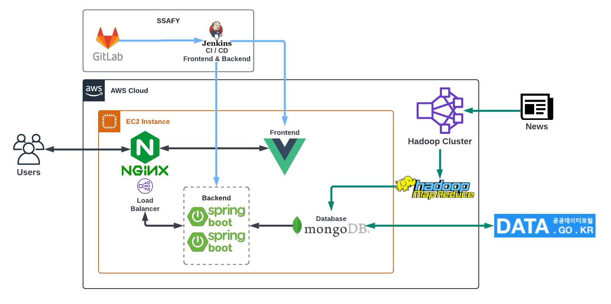

## 🚨 Seoul Emergency ! 
> 안전불감증에 취약한 우리.. 이 세상에서 잘 살아나갈수 있을까요?? 그럴 걱정할 필요없습니다. 저희 Seoul Emergency 와 함께라면요! 

## 📌 Intro

### 서비스 배경

- 대피소 검색에 대한 미흡한 대응

- 가시적이지 않은 효과로 인해 안전불감증 노출에 취약

### 서비스 목표

 #### 안전 불감증에 노출되어 있는 서울시민들을 위한 재난 안내 서비스 앱 

 

## ✨ Three Star !

> ### 저희팀은 공통적으로 SpringBoot의 백엔드 + Vue 프론트엔드 기능 및 Hadoop MapReduce 파트를 공통적으로 분배하였습니다.

###  ※ 세부역할 설명 : 홈페이지 기능 & CI/CD 담당파트 

|  이름  | 직책 |   역할   |               세부 역할                |
| :----: | :--: | :------: | :------------------------------------: |
| 노문택 | 팀장 | Backend  |       Shelter Searching & BuildSetting        |
| 송민주 | 팀원 | Backend  |       NewsList & Testing        |
| 이재영 | 팀원 | Backend  | WordCloud & Crawling |
| 하윤주 | 팀원 | Backend  |       Shelter Detail Searching & Release Setting        |
| 이정환 | 팀원 | Frontend | Shelter Mapping & Release Setting |
| 전현민 | 팀원 | Frontend | Shelter Overlay & Hadoop Setting |

## 💻Stack

#### Front

#### Backend

 

#### DB

#### DevOps

## 🌏Distribution flow

