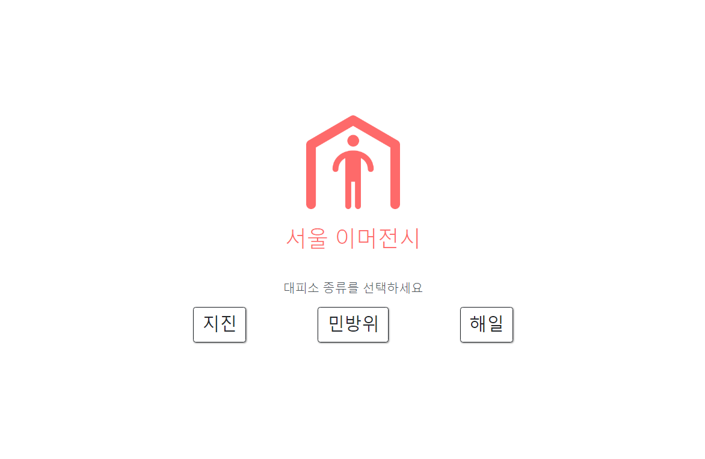
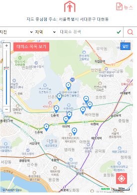
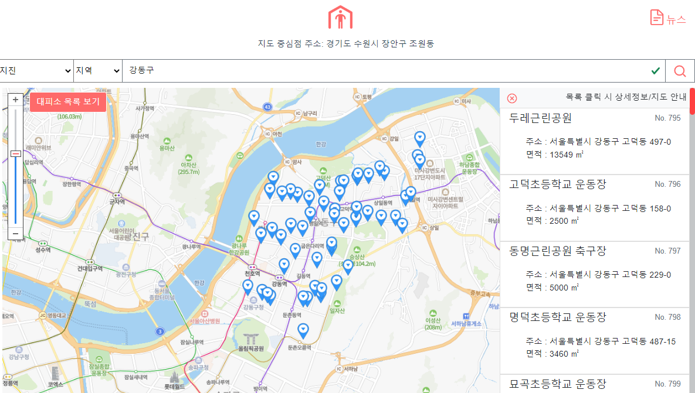
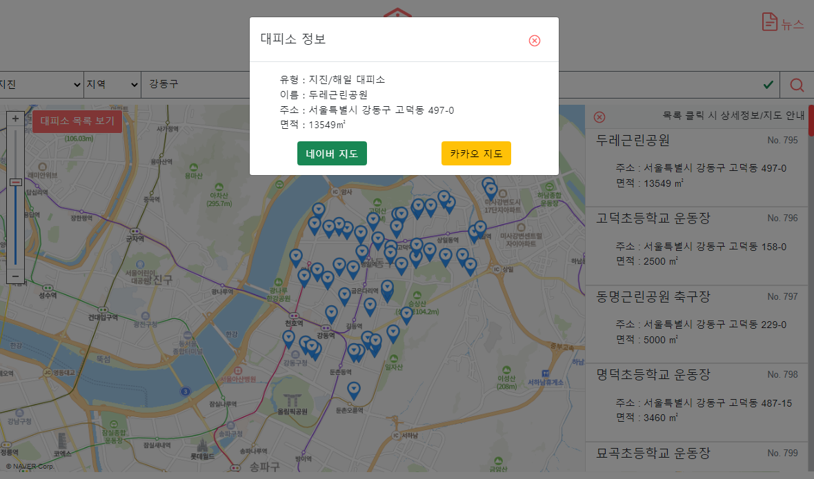
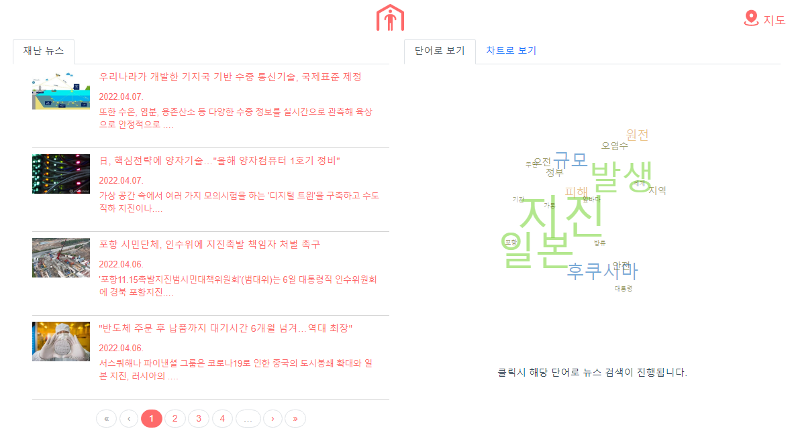
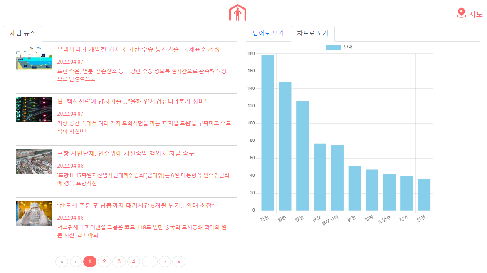

# 시연 시나리오

### 📌 양방향 서비스 플랫폼의 특성으로 내담자/상담자 측면에서 각각 두 화면을 차례로 혹은 동시에 보여주며 시연 예정

------

#### 1. 메인 화면

메인 화면 에서 원하는 대피소의 유형을 선택하면 현재 위치를 기반으로 빠르게 주변 대피소를 확인 할수 있습니다.

#### 2. 주변 대피소 Map 화면 

메인화면에서 선택후 이화면으로 이동됩니다. 반응형 웹으로 제작했으며 모바일 및 웹 환경에서 확인 가능합니다.

> 웹에서 접근

> 모바일에서 접근

#### 3. 대피소 검색 기능

검색 기능을 통해 지역명 혹은 대피소 이름별 검색이 가능합니다.

> 강동구 검색시 

> 강동구 검색후 리스트 혹은 핀 클릭시 상세정보 노출

#### 4. 뉴스 페이지 

뉴스 페이지를 통해 현재 시사토픽으로 재난 예측 혹은 뉴스리스트를 확인 할수 있습니다. 

> 04.07일 기준 조회

> 차트 확인

